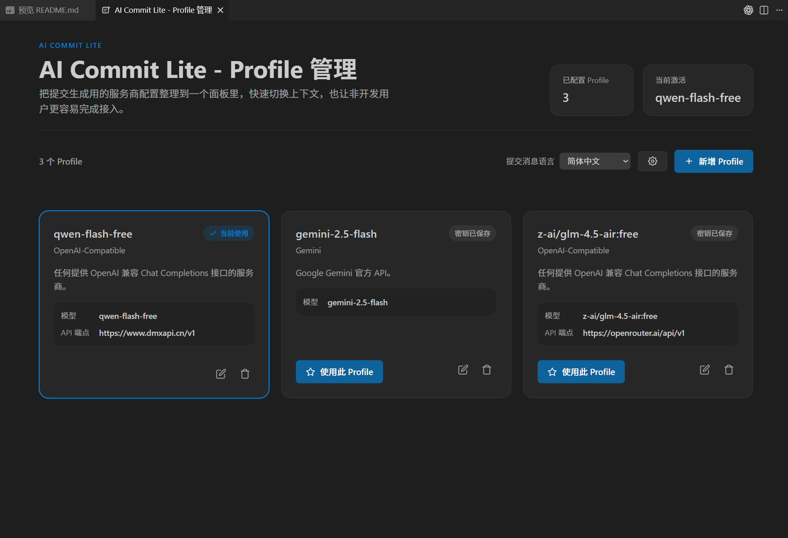
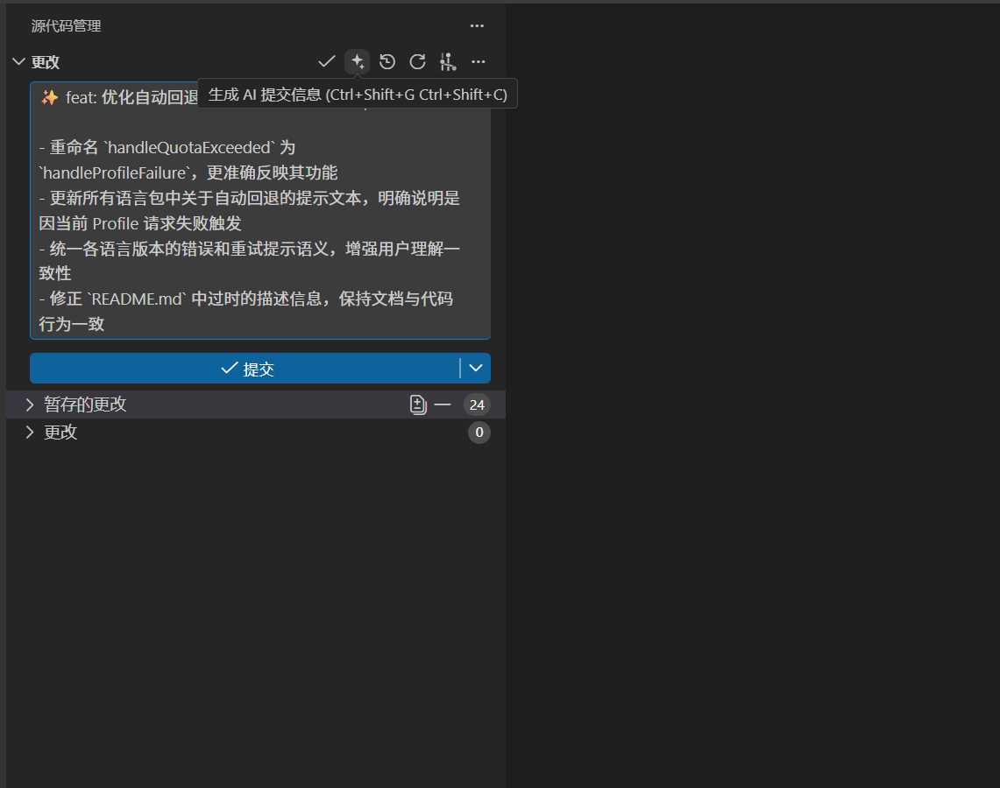

# AI Commit Lite

用 AI 为你的 Git 提交生成高质量提交信息

默认文档请见中英双语版 [README.md](README.md)。

## 快速上手

只需 3 步，即可开始生成提交信息：

**1️⃣ 安装扩展**
安装后如果没有 Profile，右下角会弹出引导提示。

**2️⃣ 配置 AI**
点击「新增 Profile」→「选择供应商」→「填入 API Key」
（密钥安全存储在 VS Code 中，不会写入普通设置）

**3️⃣ 生成提交**
```bash
git add .
```
然后使用任意方式生成：
- 命令面板：`AI Commit Lite: Generate Commit`
- SCM 标题按钮
- `Ctrl+Shift+G Ctrl+Shift+C`

生成完成后，提交信息会自动填入 Source Control 输入框。

## 功能预览




## 它能做什么

**Q: 支持哪些 AI 供应商？**
支持 OpenAI、DeepSeek、Gemini、Anthropic、Cohere、Mistral、DashScope，以及 OpenAI 兼容的 API。

**Q: API 密钥安全吗？**
是的，密钥存在 VS Code Secret Storage 中，不会明文暴露在设置里。

**Q: 可以同时用多个 AI 配置吗？**
可以。Profile 管理器支持创建多个配置（比如不同团队的账号），并可设置自动回退顺序。

**Q: 生成格式可以调整吗？**
支持 `detailed`（详细版，带要点列表）和 `concise`（简洁版，单行标题）两种风格。

**Q: 支持多语言输出吗？**
支持 10 种语言：英语、简体中文、日语、韩语、西班牙语、法语、德语、俄语、葡萄牙语、意大利语。

## 支持的供应商

| 供应商 | 说明 |
| --- | --- |
| OpenAI | OpenAI 官方模型 |
| DeepSeek | DeepSeek 官方模型 |
| Gemini | Google Gemini |
| Anthropic | Claude 系列 |
| Cohere | Command 等 |
| Mistral | Mistral 官方模型 |
| DashScope | 阿里云通义千问 |
| Azure OpenAI | Azure 部署的 OpenAI |
| OpenAI-Compatible | OpenRouter、自托管服务等 |

*需要自定义 Endpoint：Azure OpenAI、OpenAI-Compatible*

## 常用命令

| 命令 | 说明 |
| --- | --- |
| `AI Commit Lite: Generate Commit` | 生成提交信息 |
| `AI Commit Lite: Open Profile Manager` | 打开配置管理 |
| `AI Commit Lite: Switch Profile` | 切换当前 Profile |
| `AI Commit Lite: Add Profile` | 新增配置 |
| `AI Commit Lite: Edit Profile` | 编辑配置 |
| `AI Commit Lite: Delete Profile` | 删除配置 |

**快捷键**: `Ctrl+Shift+G Ctrl+Shift+C` (Windows/Linux), `Cmd+Shift+G Cmd+Shift+C` (macOS)

## 重要设置项

| 设置项 | 默认值 | 说明 |
| --- | --- | --- |
| `aiCommitLite.language` | `en` | 提交信息语言 |
| `aiCommitLite.useGitmoji` | `true` | 是否使用 Gitmoji |
| `aiCommitLite.commitMessageStyle` | `detailed` | `detailed`（详细版）或 `concise`（简洁版） |
| `aiCommitLite.enableAutoFallback` | `true` | 启用自动回退到备用 Profile |
| `aiCommitLite.profileFallbackOrder` | `[]` | 回退优先级顺序 |
| `aiCommitLite.maxDiffCharacters` | `24000` | 总体 diff 上下文上限 |
| `aiCommitLite.maxFileDiffCharacters` | `8000` | 单文件 diff 上限 |

## 常见问题

**没有看到 Profile？**
- 检查状态栏是否有「AI Commit Lite」
- 或执行 `AI Commit Lite: Open Profile Manager`

**提示没有暂存变更？**
请先执行 `git add .` 把文件加入暂存区。

**生成太慢？**
- 减少大文件和二进制文件进入暂存区
- 调整 `aiCommitLite.contextExcludePatterns` 排除更多文件

**遇到限流或配额不足？**
1. 确保 `aiCommitLite.enableAutoFallback` 已启用
2. 在 Profile 管理器中为卡片设置回退优先级

**推理模型返回格式不对？**
保持 `aiCommitLite.commitMessageStyle = detailed`，扩展会自动修正格式。

---

## 开发者信息

**要求**: Node.js 18+、VS Code 1.80+

**常用命令**:
```bash
npm run compile   # 编译
npm run watch     # 监听模式
npm run lint      # 检查
npm test          # 测试
npm run package   # 打包
```

## License

[MIT](LICENSE)